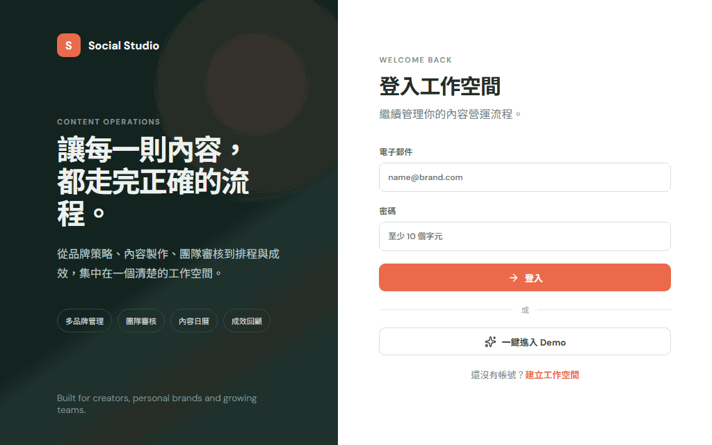

# Social Studio

面向自媒體、個人品牌與小型內容團隊的多品牌社群內容營運工作台。

## 完整流程展示



展示流程：Demo 登入 → 建立企劃與貼文 → 上傳素材 → AI 平台文案 → 團隊審核 → 核准排程 → 日曆與成效回顧。

GIF 採 16:10 桌面視窗錄製；一般畫面停留約 1.4–1.8 秒，結果頁停留約 2 秒，兼顧閱讀速度與檔案大小。

## 核心流程

```text
品牌設定 → 行銷企劃 → 多篇貼文 → AI 平台文案
→ 團隊審核 → 各平台排程 → 模擬發布／重試 → 成效回顧
```

主要功能：

- 多工作空間、多品牌與成員角色
- 單圖、輪播與短影音素材
- Campaign、Post、Platform Variant 分層管理
- AI 內容提案與平台文案
- 留言、退回、逐平台核准
- 月／週／列表日曆與拖曳改期
- 模擬發布、失敗重試與成效報表
- 可重置的完整 Demo 情境

## 技術架構

- Vue 3、TypeScript、Vite、Pinia、Vue Router
- Hono、Cloudflare Workers、D1、R2、Queues、Workers AI
- Vitest、Playwright、GitHub Actions

## 本機開發

需要 Node.js 22 以上版本。

```bash
npm install
npm run dev:worker
```

另開終端啟動前端：

```bash
npm run dev
```

## 驗證

```bash
npm test
npm run build
npm run test:e2e
```

## 部署

依照 [Cloudflare 部署指南](docs/DEPLOYMENT.md) 建立資源與 Secrets，再執行：

```bash
npm run deploy
```

詳細設計請參閱 [架構說明](docs/ARCHITECTURE.md)。
